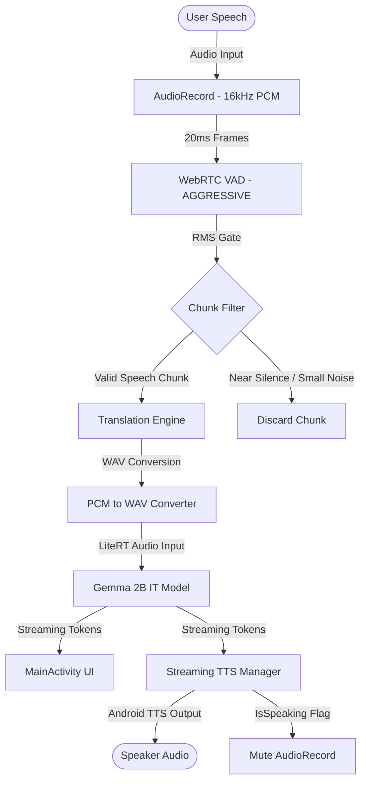

# SyncDialect

SyncDialect is a high-performance, 100% offline, real-time voice translation Android application built with Kotlin and Jetpack Compose. By leveraging Google LiteRT (formerly MediaPipe LLM Inference API) and the Gemma 2B IT audio-multimodal model on-device, SyncDialect provides instantaneous voice-to-voice translation without relying on cloud servers.

With an average end-to-end delay/latency of **600–800 ms**, SyncDialect is one of the fastest—if not the only fastest—offline voice real-time translators available.

---

## 📐 System Architecture

The following diagram illustrates the flow of audio processing, speech segmentation, translation, and Text-to-Speech synthesis:



---

## 🚀 Key Features

*   **Ultra-Low Latency**: Achieves real-time translation with a delay of only **600–800 ms**, enabling natural flow in bilingual conversations.
*   **100% Offline & Private**: Runs entirely local on-device. No audio data, transcribed text, or translations are uploaded to the cloud, ensuring complete data privacy.
*   **Advanced Voice Activity Detection (VAD)**: Employs a low-latency WebRTC VAD system to detect natural pauses in speech and automatically trigger translations.
*   **Acoustic Loop Prevention**: Integrates active feedback protection by automatically muting the microphone input while the Text-to-Speech (TTS) engine is playing translation outputs.
*   **Foreground Download Service**: Implements a robust foreground service to download the model weight file directly from Hugging Face with auto-resume on network drops and redirect management.
*   **Premium Material 3 UI**: Features a sleek, modern dark-mode aesthetic with custom-drawn canvas waveforms and dynamic user interfaces.

---

## 🛠️ Codebase Structure

*   `app/src/main/java/com/syncdialect/app/`
    *   **[MainActivity.kt](app/src/main/java/com/syncdialect/app/MainActivity.kt)**: Application coordinator. Handles the Jetpack Compose UI state, navigation, permission requests, and coordinates translation triggers.
    *   **[TranslationEngine.kt](app/src/main/java/com/syncdialect/app/TranslationEngine.kt)**: Interfaces with the LiteRT model engine, converts raw PCM audio into WAV format on-the-fly, and feeds it into the Gemma 2B IT model.
    *   **[AudioRecorderHelper.kt](app/src/main/java/com/syncdialect/app/AudioRecorderHelper.kt)**: Manages recording from the microphone, frame slicing, WebRTC VAD analysis, and energy gating.
    *   **[StreamingTTSManager.kt](app/src/main/java/com/syncdialect/app/StreamingTTSManager.kt)**: Buffers translation tokens and streams speech synthesis through the Android native TTS API.
    *   **[ModelDownloadService.kt](app/src/main/java/com/syncdialect/app/ModelDownloadService.kt)**: Handles large-file HTTP downloads in the background with WakeLock protection.
    *   **[SettingsScreen.kt](app/src/main/java/com/syncdialect/app/SettingsScreen.kt)**: Provides controls for language management, offline model updates, and speech speed adjustment.

---

## 🏗️ Compiling and Running the App

### Prerequisites
*   Android SDK (compileSdk = 36)
*   Java JDK 17
*   The application requires the Gemma model weight file (`gemma-4-E2B-it.litertlm`) placed under the app's files directory. The app contains a built-in download screen to retrieve this on first startup.

### Build Commands
Compile the app directly from your terminal using Gradle:

*   **Build Debug APK**:
    ```bash
    ./gradlew assembleDebug
    ```
*   **Compile Release AAB (Android App Bundle)**:
    ```bash
    ./gradlew :app:bundleRelease
    ```
*   **Compile Debug AAB**:
    ```bash
    ./gradlew :app:bundleDebug
    ```

*Note: Release bundles are signed using the signing keys specified in `app/build.gradle.kts`.*
