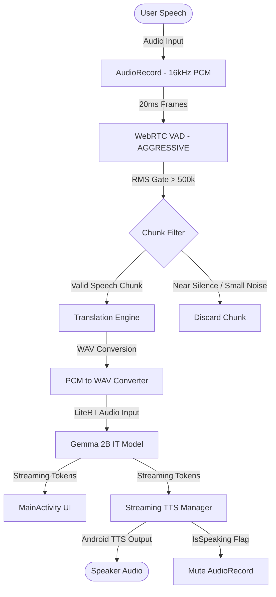

# SyncDialect (Formerly AuraVoice Live)

SyncDialect is a real-time, low-latency, 100% offline voice translation Android application built with Kotlin, Jetpack Compose, and Google LiteRT (formerly MediaPipe LLM Inference API). It runs the Gemma 2B IT (Instruction Tuned) audio-multimodal model locally on-device to translate spoken words in real time.

---

## 📐 System Architecture

The following diagram illustrates the flow of audio processing, silence detection, LLM inference, and Text-to-Speech synthesis in SyncDialect:



---

## 🚀 Key Features

*   **100% On-Device Translation**: No audio or text leaves the device. Translations are run completely offline.
*   **Low Latency Streaming**: Delivers translated text tokens under 1.3 seconds (Time to First Token) on standard hardware.
*   **Voice Activity Detection (VAD)**: Utilizes WebRTC VAD to segment audio dynamically during continuous speech.
*   **Acoustic Loop Prevention**: Automatically mutes microphone recording while the TTS system is speaking to avoid feedback loops.
*   **Resumeable Model Downloader**: Leverages a robust foreground service to download the 2.2 GB model files from Hugging Face with range-request and redirect support.

---

## 🛠️ Codebase Structure

*   `app/src/main/java/com/syncdialect/app/`
    *   **[MainActivity.kt](app/src/main/java/com/syncdialect/app/MainActivity.kt)**: Entry point, handles UI rendering (Compose), navigation, and main translation control flow.
    *   **[TranslationEngine.kt](app/src/main/java/com/syncdialect/app/TranslationEngine.kt)**: Manages LiteRT, handles conversational model configurations, and runs inference.
    *   **[AudioRecorderHelper.kt](app/src/main/java/com/syncdialect/app/AudioRecorderHelper.kt)**: Manages hardware audio recording, WebRTC VAD framing, and energy gating.
    *   **[StreamingTTSManager.kt](app/src/main/java/com/syncdialect/app/StreamingTTSManager.kt)**: Buffer manager that streams token outputs to the Android TextToSpeech engine.
    *   **[ModelDownloadService.kt](app/src/main/java/com/syncdialect/app/ModelDownloadService.kt)**: Background download service with wake locks and download progress management.
    *   **[SettingsScreen.kt](app/src/main/java/com/syncdialect/app/SettingsScreen.kt)**: Preferences, voice selectors, and model files settings screen.

---

## ⚙️ Configuration & Tuned Settings

To prevent translation hallucinations and acoustic feedback, the project uses these meticulously tested parameters:

| Parameter | Value | Component | Rationale |
| :--- | :--- | :--- | :--- |
| **Backend** | `Backend.CPU()` | LiteRT Engine | Audio inputs are not supported on GPU. CPU is mandatory. |
| **Max Tokens** | `2048` | LiteRT Engine | Required to accommodate larger audio context limits. |
| **Temperature / Top-K** | `0.1` / `1` | Sampler | Deterministic inference to prevent translation hallucinations. |
| **VAD Mode** | `VERY_AGGRESSIVE` | WebRTC VAD | Ultra-low latency silence detection. |
| **VAD Wait** | `40` (800ms) | Audio Record | Wait window after user stops speaking before starting translation. |
| **Max Chunk Size** | `96,000` (3s) | Audio Record | Splitting continuous audio into max 3s blocks prevents long queues. |
| **RMS Energy Gate** | `> 500,000` | Audio Record | Skips silent blocks to avoid loading the model with empty input. |

---

## 🏗️ Compiling and Running the App

### Prerequisites
*   Android SDK (compileSdk = 36)
*   Java JDK 17
*   The application requires downloading the Gemma model file (~2.2 GB) upon first launch or placing `gemma-4-E2B-it.litertlm` under the app's files directory.

### Build Commands
Compile the app directly from your terminal using Gradle:

*   **Build Debug APK**:
    ```bash
    ./gradlew assembleDebug
    ```
*   **Compile Release AAB (Android App Bundle)**:
    ```bash
    ./gradlew :app:bundleRelease
    ```
*   **Compile Debug AAB**:
    ```bash
    ./gradlew :app:bundleDebug
    ```

*Note: Release bundles are signed using the keystore specified in `app/build.gradle.kts`.*
